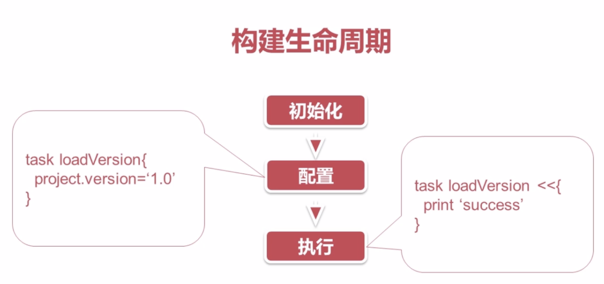
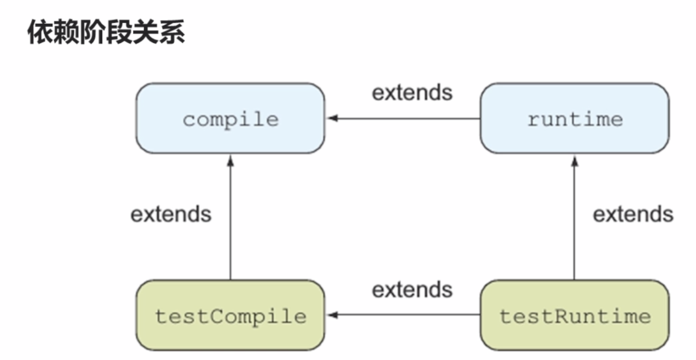

# Groovvy
## 定义
* 用于java虚拟机的敏捷动态语言
* 面向对象
* 脚本语言
* 代码简洁
* 闭包+动态语言其他特性
## VS java
* 兼容java
* 分号可选
* 类/方法默认是public
* 编译器自动给属性添加get/set方法
* 属性可以直接是用"."获取
* 方法中最后一个表达式的值会作为返回值
* == 等同于equals(),不会有nullpointerexceptions
## 高效特性
* assert语句
* 弱类型定义
* 可选的括号（调用参数/方法没有参数，括号可省略）
* 字符串
```groovy
// 三个引号可以换行
def s1='anjie'
def s2="anjie+$version"
def s3='''anjie anjie anjie'''
```
* 集合API
```groovy
//list
builldTools=['anjie',"anjie2"]
builldTools << "anjie3"
assert builldTools.class == ArrayList
assert builldTools.size()==3
//map
def buildYears=["ant":2000,"maven":2004]
buildYears.gradle=2009
println buildYears.ant
println buildYears['gradle']
println buildYears.getClass()
```
* 闭包
```groovy
def hello = { String x ->
    printf("hello ${x}")
}
hello("world")
```
 # Gradle
## 构建脚本（build.gradle）
* 每个构建脚本至少包含一个项目，包含一个或多个任务
* 多项目构建中，一个项目可以依赖其他项目
* 任务可以形成依赖关系图，保证执行顺序
### 项目project
启动构建，Gradle基于build.gradle实例话一个org.gradle.api.Project类，通过project变量使其可用
* 属性(坐标)
    * group
    * name
    * version
* 方法
    * apply
    * dependences
    * repositiories
    * task
        * 任务对于org.gradle.api.Task,任务动作+任务依赖
        * 方法
            * dependsOn：声明任务依赖
            * doFirst doLast <<
* 属性的其他配置方式：
    * ext/gradle.properties
### 自定义任务
### 构建生命周期

### 依赖管理(https://search.maven.org/)
* 坐标
* 仓库
    * mavenLocal/mavenCentral/JCenter
    * 自定义maven仓库
    * 文件仓库
* 依赖阶段配置
    * compile、runtime
    * testCompile、testRuntime

## 多项目构建（settings.gradle）
